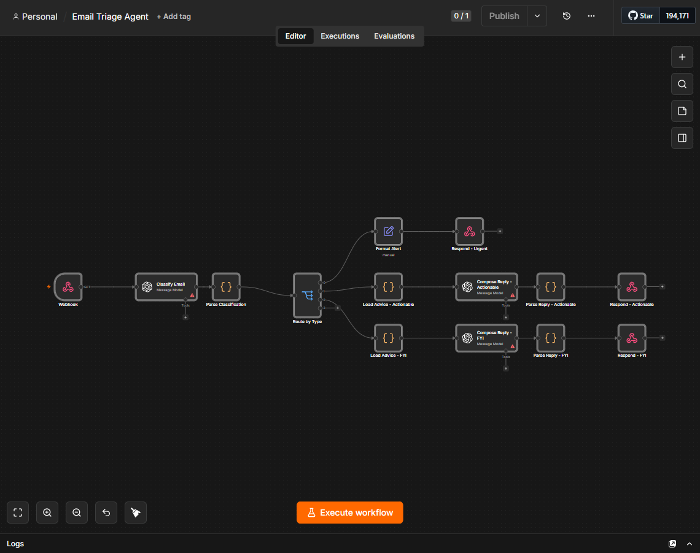
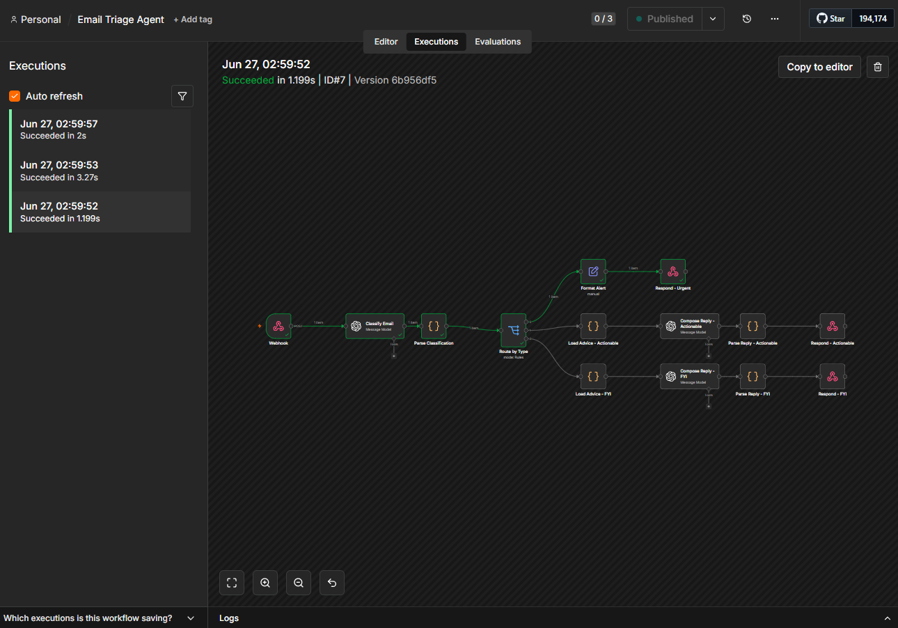
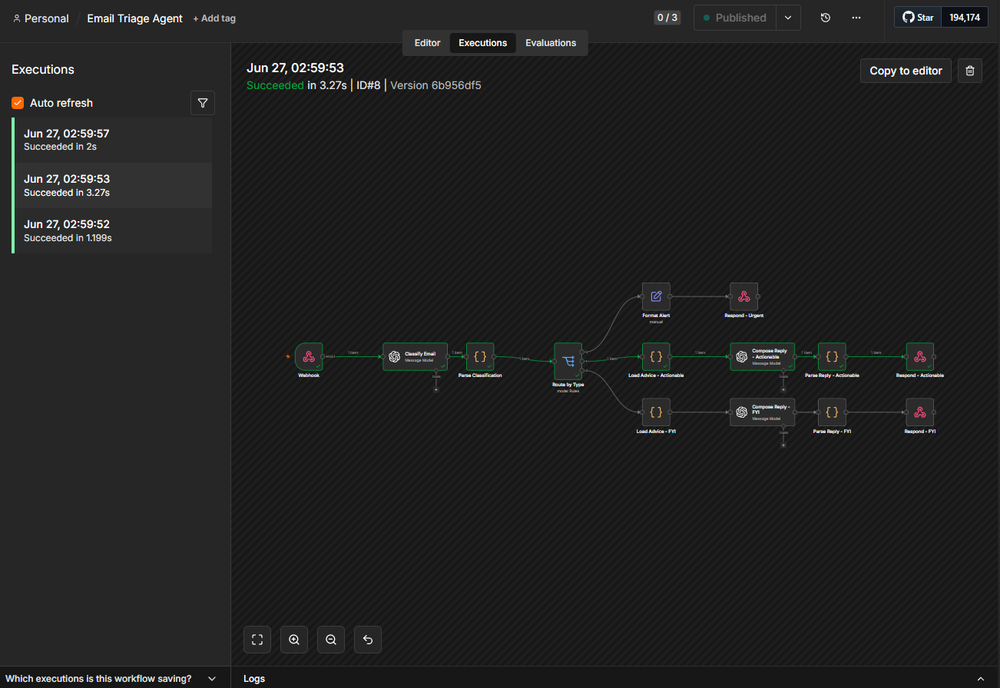
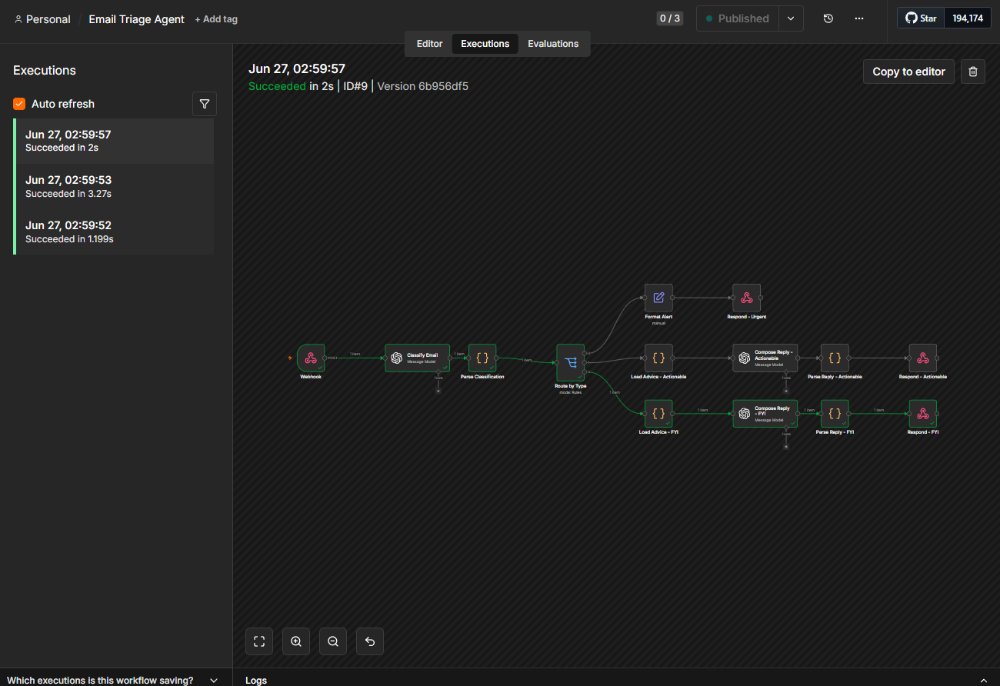

# n8n Email Triage Agent

An intelligent email triage workflow built with [n8n](https://n8n.io/) and OpenAI. Incoming emails are classified by urgency, routed accordingly, and — where appropriate — replied to by an AI channelling the energy of a detached but well-meaning sage.

Built as a portfolio demonstration of LLM-powered workflow automation using n8n.

**Demonstrates:** webhook-triggered LLM classification · structured JSON schema enforcement · classify-then-dispatch routing · two-stage prompt orchestration · self-hosted on Docker via n8n.

---

## What It Does

The workflow receives an email payload, classifies it, and routes it:

- **Urgent** — time-sensitive emails trigger a priority alert. No auto-reply. Some things should not be philosophically deflected.
- **Actionable** — emails requiring follow-up get a reply: a warm acknowledgement, and a single piece of unsolicited life advice drawn from a curated database. No transition between the two.
- **FYI** — informational emails get the same treatment. Acknowledged. Advised. Archived.

Replies are returned as webhook responses, designed to be swapped for real sends when connected to Gmail.

---

## Architecture

The workflow implements a **classify-then-dispatch pattern**: a language model makes a structured classification decision that determines which downstream branch executes. This is a lightweight form of agentic routing — the LLM controls the flow, not conditional logic applied to hand-coded rules.

```
Webhook Trigger (POST)
     │
     ▼
OpenAI Message Model (gpt-4o)
  — classifies intent, returns structured JSON
     │
     ▼
Code Node — Parse Classification
  — strips markdown fences, parses JSON response
     │
     ▼
Switch Node (routes on classification field)
     │
     ├── "urgent"     → Set Node (format alert)   → Respond to Webhook
     │
     ├── "actionable" → Code Node (load advice)   → OpenAI Message Model (compose reply) → Code Node (parse reply) → Respond to Webhook
     │
     └── "fyi"        → Code Node (load advice)   → OpenAI Message Model (compose reply) → Code Node (parse reply) → Respond to Webhook
```

**Where the JavaScript lives:** Four Code nodes are embedded in `workflow.json`. These handle all data transformation logic:
- `Parse Classification` — strips LLM markdown fences, JSON-parses the classification response
- `Load Advice - Actionable` / `Load Advice - FYI` — inlines the advice corpus, joins entries for prompt injection
- `Parse Reply - Actionable` / `Parse Reply - FYI` — extracts reply and advice fields, shapes the final response object

### Why structured JSON output from the LLM?

The classification node is prompted to return a fixed JSON schema — `classification`, `reason`, `summary` — rather than free-form text. This means the Switch node routes on a deterministic string value, not on parsed prose. In any LLM-powered automation, the boundary between the model's output and the rest of the system should be a schema, not a string match.

### Why two separate prompts?

The workflow uses two structurally different prompts. The classification prompt enforces a rigid output schema — precision matters more than fluency. The reply prompt is the opposite: open-ended generation with a loose format constraint. Mixing these concerns into a single prompt would degrade both. Keeping them separate also means each can be tuned, swapped, or evaluated independently without touching the other.

### Why not a vector database for advice selection?

The advice corpus is 30 entries. At that scale, **in-context retrieval** — passing the full corpus as prompt context and letting the model select — produces better results than **semantic retrieval** from a vector store. The model sees everything at once and makes a more nuanced choice. A vector store earns its place when the corpus is large enough that fitting it into a prompt becomes impractical or expensive. At 30 entries, it isn't.

---

## The Advice Database

The advice corpus lives in `advice/advice.json` — a simple array of 30 aphorisms, pre-populated and ready to use. The LLM receives the full list alongside the email content and selects the one it judges most fitting. No explanation is offered for the selection.

Edit the file freely to add, remove, or replace entries. The format is a flat JSON array of strings:

```json
[
  "A river does not apologise for its banks.",
  "The door you are looking for opens from the other side.",
  "Urgency is a feeling. Deadlines are a choice someone else made."
]
```

---

## Reply Format

Auto-replies follow a fixed structure enforced by the prompt:

1. One or two sentences acknowledging the sender's email — warm, brief, specific
2. A single piece of advice from the corpus — no preamble, no explanation, no transition
3. Sign-off: *Sent from a place of clarity*

**Example (actionable):**

> Thanks for following up on the proposal — I'll get that over to you shortly.
>
> Not everything that feels like waiting is delay.
>
> Sent from a place of clarity

---

## Prerequisites

- [Docker](https://www.docker.com/)
- An [OpenAI API key](https://platform.openai.com/api-keys)
- `jq` (optional, for pretty-printing test output — `brew install jq`)

---

## Running Locally

**1. Start n8n**

```bash
docker run -it --rm \
  -p 5678:5678 \
  -v n8n_data:/home/node/.n8n \
  n8nio/n8n
```

Open [http://localhost:5678](http://localhost:5678) and create a local account.

**2. Import the workflow**

- In n8n, go to **Workflows → Import from file**
- Select `workflow.json` from this repo

**3. Add your OpenAI credentials**

- Go to **Settings → Credentials → Add credential → OpenAI**
- Paste your API key
- n8n will prompt you to assign credentials when you import the workflow — both OpenAI nodes contain a placeholder ID (`REPLACE_WITH_YOUR_CREDENTIAL_ID`) that n8n flags on import
- Select your new credential from the dropdown for each node

**4. Activate the workflow**

The UI depends on your n8n version:

- **v2.0+** — Click the **Publish** button in the top-right corner of the canvas. A green checkmark confirms the workflow is live. To deactivate later, click the `...` menu next to Publish and select **Unpublish**.
- **Pre-v2.0** — Toggle the workflow to **Active** in the top-right of the editor.

**5. Run the test script**

```bash
chmod +x scripts/test.sh
./scripts/test.sh
```

This fires three sample payloads and prints the routed response for each.

Or test a single case manually:

```bash
curl -X POST http://localhost:5678/webhook/email-triage \
  -H "Content-Type: application/json" \
  -d @sample-payloads/actionable.json
```

---

## Sample Payloads

| File | Expected classification |
|------|------------------------|
| `urgent.json` | `urgent` — alert only, no reply |
| `actionable.json` | `actionable` — acknowledged + advised |
| `fyi.json` | `fyi` — acknowledged + advised |

---

## Example Output

**Urgent:**
```json
{
  "status": "URGENT",
  "alert": "Priority action required",
  "summary": "Client requesting contract renewal confirmation before end of business Friday.",
  "reason": "Contains an explicit deadline and threat of alternative action."
}
```

**Actionable:**
```json
{
  "status": "REPLY_SENT",
  "reply": "Thanks for following up on the proposal — I'll get that over to you shortly.\n\nNot everything that feels like waiting is delay.\n\nSent from a place of clarity",
  "advice_used": "Not everything that feels like waiting is delay.",
  "summary": "Partner requesting updated proposal from last week's meeting."
}
```

**FYI:**
```json
{
  "status": "REPLY_SENT",
  "reply": "Thanks for sending this over — noted.\n\nThe map is not the territory, but it is still useful to have a map.\n\nSent from a place of clarity",
  "advice_used": "The map is not the territory, but it is still useful to have a map.",
  "summary": "Weekly tech digest newsletter."
}
```

---

## Repo Structure

```
n8n-email-triage-agent/
├── README.md
├── workflow.json                 # n8n workflow export
├── advice/
│   └── advice.json               # curated advice corpus (30 entries)
├── sample-payloads/
│   ├── urgent.json
│   ├── actionable.json
│   └── fyi.json
├── scripts/
│   ├── test.sh                   # curl test runner (bash)
│   └── test.ps1                  # curl test runner (PowerShell)
└── docs/
    └── screenshots/
        ├── workflow_overview.png  # full canvas view
        ├── urgent_branch.png      # execution trace — urgent
        ├── actionable_branch.png  # execution trace — actionable
        └── fyi_branch.png         # execution trace — fyi
```

---

## Troubleshooting

**`404 — This webhook is not registered for POST requests`**

Two possible causes:
- The workflow isn't published/active. Click **Publish** (v2.0+) or toggle **Active** (pre-v2.0) before hitting the webhook.
- You're targeting the test URL (`/webhook-test/`) instead of the production URL (`/webhook/`). The test URL only responds while you're in the n8n editor with the workflow in active test mode. The scripts use the production URL — publish the workflow first.

**All emails route to the urgent branch**

The Switch node's routing rules aren't matching. Open the Switch node in the editor and confirm it has three separate output ports (one per rule). If all rules show output 0, the workflow JSON has a Switch node version mismatch — re-import `workflow.json` and reassign credentials. The current file uses `typeVersion: 3` which creates distinct output ports per rule.

**OpenAI nodes show a credential error after import**

Expected — the workflow ships with a placeholder credential ID. After importing, open each OpenAI node (Classify Email, Compose Reply - Actionable, Compose Reply - FYI) and select your credential from the dropdown.

**The reply nodes execute but return a JSON parse error**

The LLM occasionally wraps its response in markdown code fences (` ```json ``` `). The Parse Classification and Parse Reply code nodes strip these automatically. If you're seeing this error, check that you're running the latest `workflow.json` — earlier versions didn't include the strip step.

**`test.ps1` works but `test.sh` doesn't**

The shell script requires `jq` for pretty-printing (`brew install jq` on Mac, `apt install jq` on Linux). Without it, pipe to `cat` instead, or just use `test.ps1` on Windows.

---

## Screenshots

**Workflow canvas**



**Execution traces** — all three branches tested live, each resolving in under 3s end-to-end.

| Branch | Execution |
|--------|-----------|
| Urgent |  |
| Actionable |  |
| FYI |  |

---

## Extending to Gmail

The webhook trigger is a stand-in for a real email source. To connect a live Gmail inbox:

1. Replace the **Webhook** node with n8n's **Gmail Trigger** node
2. Set up a Google Cloud OAuth app and add the credentials to n8n
3. Configure the trigger to fire on new emails matching your criteria
4. Map `{{ $json.from }}`, `{{ $json.subject }}`, and `{{ $json.snippet }}` to the classification node inputs
5. Replace the **Respond to Webhook** nodes with **Gmail: Send** nodes

The classification, routing, and reply logic is unchanged. See [n8n Gmail Trigger docs](https://docs.n8n.io/integrations/builtin/trigger-nodes/n8n-nodes-base.gmailtrigger/) for setup details.

---

## Stack

- [n8n](https://n8n.io/) — workflow automation
- [OpenAI API](https://platform.openai.com/) — classification and reply generation (gpt-4o)
- Docker — local n8n instance